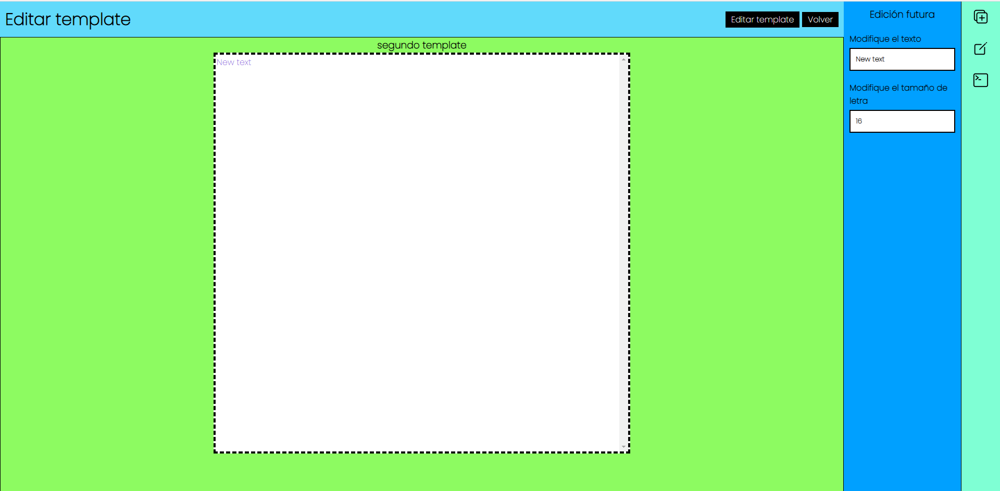

### System Drag and Drop in developing

1. Se pueden crear templates
   

2. Al precionar edit entramos a la siguiente ventana
   

- donde podemos agregar tres tipos de objetos
  - Divider
  - Text
  - Image
- Por el momento solo se puede cambiar el tamaño de fuente y el texto del objeto tipo text
