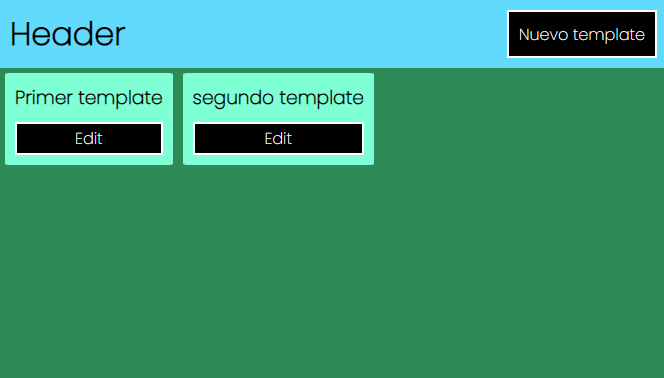
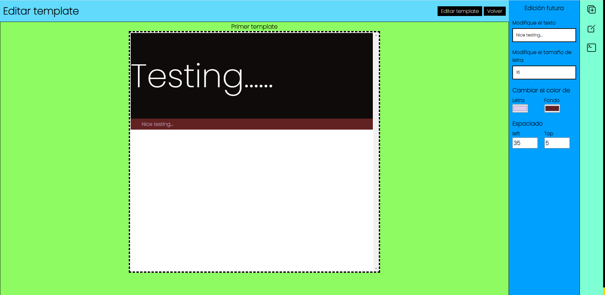
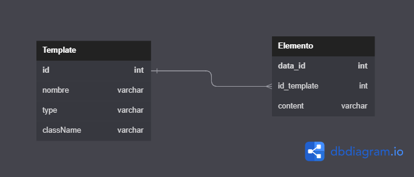

### System Drag and Drop in developing

1. Se pueden crear templates
   

2. Al precionar edit entramos a la siguiente ventana
   

3. Modelo preliminar de persistencia en la BD
   

- Donde podemos agregar tres tipos de objetos
  - Divider
  - Text
  - Image
